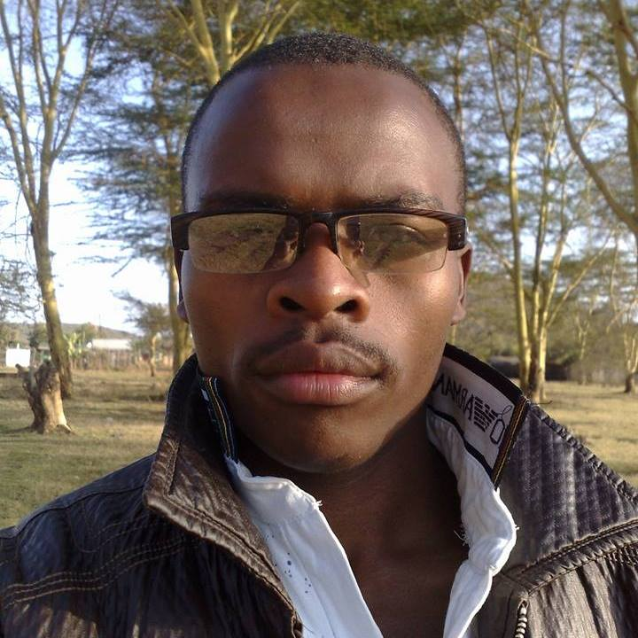

# Table of contents for a fruit vendor
1. [project description.]()
2. [author/contributors]()
3. [project copy right and licencing]()
4. [mangoes]()

# project description 
This is a photography website dealing with the following servces
1. [events coverages ](#)
2. [photoshooting ](#)
3. [film making and all other photography services]()

# Author and contributors 
1. [ERICK GITONGA NJERU -STUDENT at Moringa school]()
2. [ROSE-INSTRUCTOR & ALBERT-TMS-moringa school]()

# ABOUT THE AUTHOR
Erick Gitonga Njeru is a renown sofware development student currently enhansing his skills at Moringa school. among many other projects erick was a core-founder of top galaxy photograpy

# CONTRIBUTORS
ROSE & ALBERT are MORINGA SCHOOL technical mentor-senior developers who have guided me through the process.

## project livelink
(https://erick-njeru.github.io/ERICK-NJERU-PHOTOGRAPHY-WEBSITE/)

PROJECT COPYRIGHT AND LICENCING

this project remains the property of the contributors, no coppying without prior notification and authorization from the "owners"

 
# ALbert

# Rose